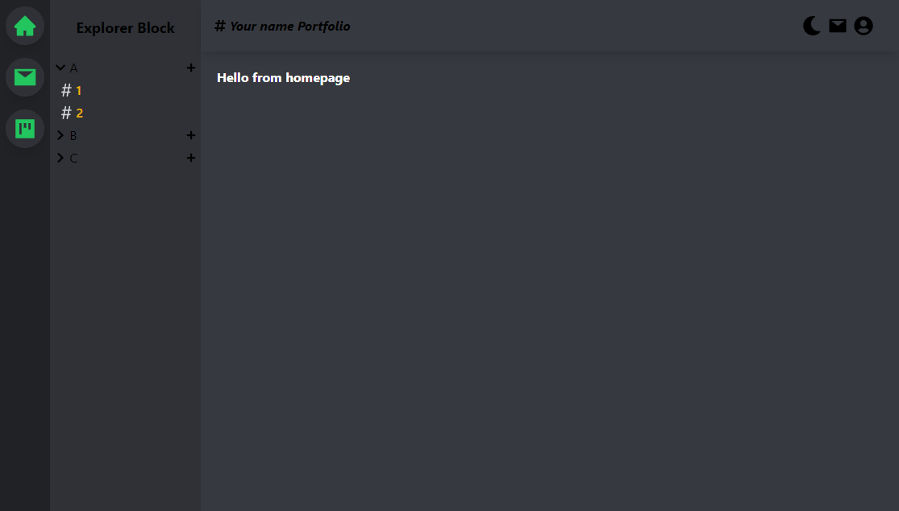
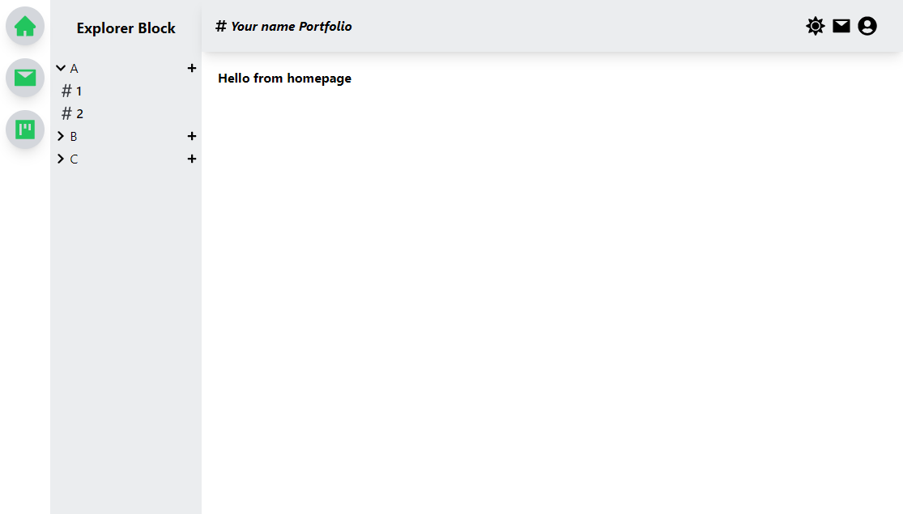

# Work in progress

# Discord themed portfolio

## :link:	Live Demo 
[Demo Link](https://discord-themed-portfolio.vercel.app/)

## 📷 Screenshot

### DarkMode On
  
  
### DarkMode Off
  
  

## 📝 Project Description

Discord themed portofolio to showcase your work

## 📚 Technologies

- ReactJS
- NextJS
- TailwindCSS

## :runner: Run Locally

Clone the project

```bash
  git clone https://github.com/trstefan/discord-themed-portfolio.git
```

Go to the project directory

```bash
  cd discord-themed-portfoli
```

Install dependencies

```bash
  npm install
```

Start the server

```bash
  npm run dev
```

